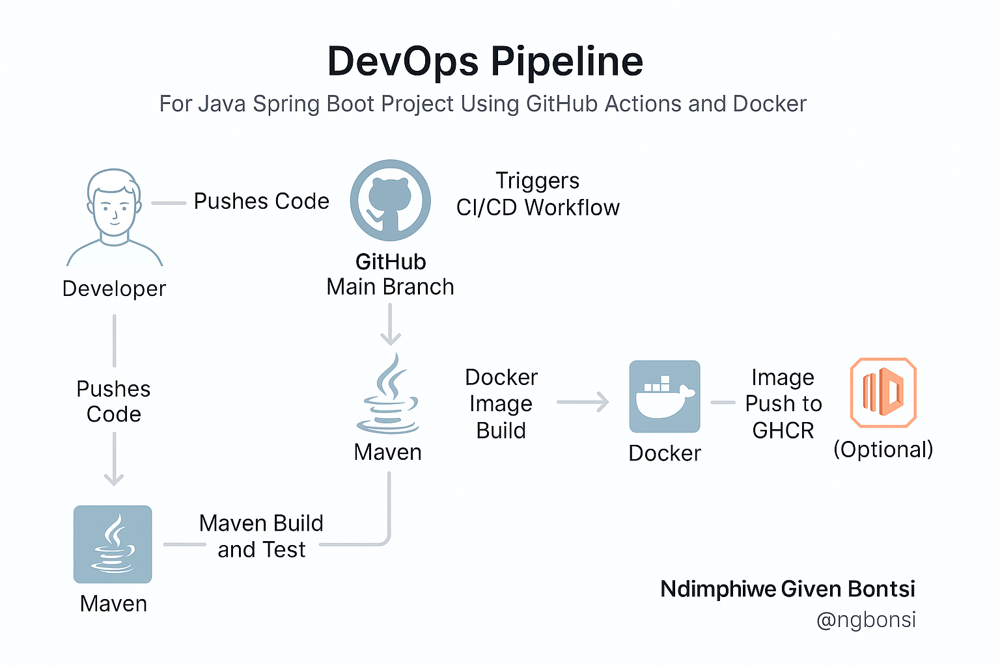

# 📂 Original Task Manager

A simple task monitoring app with offline-first support, reminders, and future online sync capabilities. Built with **Spring Boot** backend and planned **Flutter** frontend, this app is aimed at personal productivity and team collaboration.

&#x20;

---

## ✨ Features

- 📋 Task creation and management
- ⏰ Reminders until completion
- 🔌 Offline support (Flutter - WIP)
- 🐳 Dockerized backend
- 📆 CI/CD enabled with GitHub Actions
- ☁️ Designed for future AWS / cloud deployment

---

## 🚀 Getting Started

### Prerequisites

- Java 24 (Temurin)
- Maven
- Docker (optional if only running locally via Maven)
- Git

### Running locally

```bash
git clone https://github.com/ngbontsi/originalTaskManager.git
cd originalTaskManager
mvn clean package
java -jar target/originaltaskmanager-1.0-SNAPSHOT.jar
```

### Running with Docker

```bash
docker build -t originaltaskmanager .
docker run -p 8080:8080 originaltaskmanager
```

---

## ⚙️ CI/CD

This project uses GitHub Actions to:

1. 🔨 Build and test Maven project
2. 🐳 Build and push Docker image to GHCR
3. 📆 Simulate deployment (AWS-ready)

View the pipeline:\
[.github/workflows/ci-cd.yml](.github/workflows/ci-cd.yml)

---

## 📁 Project Structure

```bash
.
├── src/main/java/org/example/originaltaskmanager
├── target/
├── Dockerfile
├── .github/workflows/ci-cd.yml
├── pom.xml
└── README.md
```

---

## 🔪 Tests

```bash
mvn test
```

Unit and integration tests are executed automatically in the CI pipeline.

---

## 🤝 Contributing

1. Fork this repository
2. Create a new branch (`feature/my-feature`)
3. Commit your changes
4. Push and open a PR

All contributors are welcome!
---
---

## 📦 Running Locally with Docker

To run the `originaltaskmanager` Spring Boot application inside Docker:

### **1. Build the Application**

```bash
./mvnw clean package
```

This creates the JAR file in the `target/` directory.

---

### **2. Build the Docker Image**

```bash
docker build -t originaltaskmanager:local .
```

---

### **3. Run the Docker Container**

```bash
docker run -p 8080:8080 originaltaskmanager:local
```

This will:
- Start the application
- Map port `8080` from the container to your local machine

You can now access the app at:  
👉 [http://localhost:8080](http://localhost:8080)

---

### ✅ Requirements

Make sure you have:
- [Docker Desktop](https://www.docker.com/products/docker-desktop) installed and running
- Docker integrated with your IDE (optional but recommended)
- Java 17+ and Maven installed (or use Maven wrapper `./mvnw`)

---
### 🚀 What does this PR do?
<!-- Describe your changes here -->

---

### ✅ Checklist before requesting review:
- [ ] The code compiles and runs locally
- [ ] All tests pass (if applicable)
- [ ] I've added or updated documentation
- [ ] I've linked the related issue (if any)
- [ ] I've updated the status of the task (if tracked)

---

### 🧠 Additional context (optional)
<!-- Add screenshots, references, or context here -->

---

### 📅 Deadline (if any)
<!-- Add if there's urgency -->

---
## 🛠️ CI/CD DevOps Pipeline

Below is the flow of our DevOps pipeline for building, testing, and deploying:


---
## 👤 Author

**Ndimphiwe Given Bontsi**\
📧 [ngbontsi@gmail.com](mailto\:ngbontsi@gmail.com)\
📱 +27 64 632 0739\
🔗 [GitHub](https://github.com/ngbontsi) • [LinkedIn](https://www.linkedin.com/in/ndimphiwe-bontsi-368b4960)

---

## 📃 License

This project is licensed under the MIT License. See [LICENSE](LICENSE) for more info.

